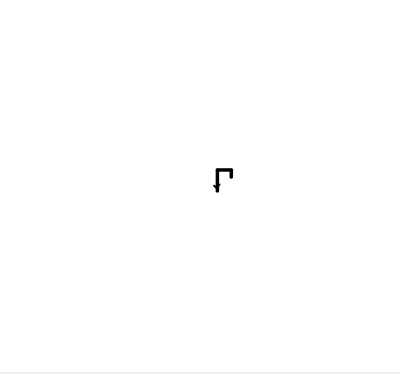

# Computação Gráfica - Aspiral quadrada 🌀

<f2 align = "left"> **O seguinte projeto possui o objetivo de construir uma aspiral quadrada por meio de conhecimentos com fractal e turtle.**</f2> 

 

# Importando o módulo Turtle

Para utilizar um módulo no Python, utilizamos o comando import (importar) seguido do nome do módulo que queremos importar. Após a importação, já podemos utilizar todos os objetos e funções que o módulo disponibiliza.
   
  
    import turtle
    

Primeiro, o código define o tamanho da caneta para 5 usando a função:
   
  
    turtle.pensize(5)
  

 Em seguida, o código entra em um loop for que será executado seis vezes (para os seis lados do hexágono). Dentro do loop, a tartaruga avança 100 pixels usando a função forward() e, em seguida, vira 60 graus para a esquerda usando a função left(). A tartaruga continuará avançando e virando à esquerda até completar um hexágono completo.: 

    for i in range(6):
    turtle.forward(100)
    turtle.left(60)

 Por fim, o código cria uma janela gráfica de tartaruga e espera o usuário clicar na tela antes de fechar a janela. Isso é feito usando a função Screen() para criar a janela e a função exitonclick() para aguardar o clique do usuário antes de fechar a janela:

    turtle.Screen().exitonclick()
